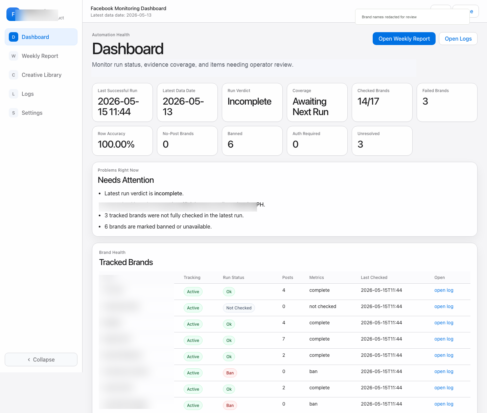
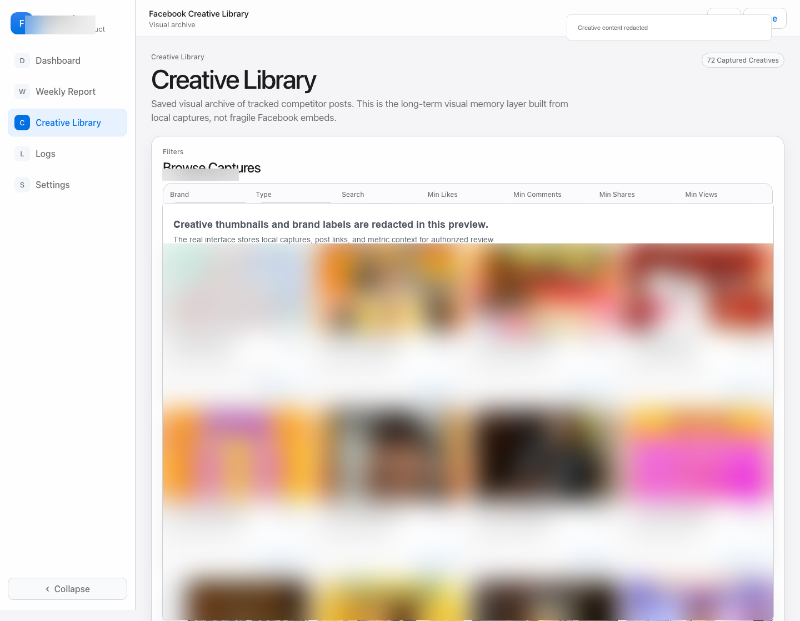

# SocialEagle Public Page Monitor

SocialEagle is a Codex skill for evidence-first public social monitoring workflows. It helps teams review public Facebook page activity, preserve a clear audit trail, and fail closed when coverage is incomplete.

Live product preview: https://socialeagleph.vercel.app/

Project by [www.hubinasia.com](https://www.hubinasia.com/)

## Why This Exists

Teams often need a daily view of public competitor activity, creative examples, and monitoring health. SocialEagle focuses on the operating discipline around that workflow:

- public-page scope only
- clear status before conclusions
- exact blockers when evidence is incomplete
- private sessions and credentials kept out of reports, docs, and public files
- low-impact off-hours operation for browser-heavy checks

This repository is a publish-safe skill template. It does not include private account sessions, cookies, credentials, generated client reports, or private target lists.

## What The Skill Does

- Reads a daily safety JSON file and reports whether the run is complete.
- Lists blocking targets with status reasons instead of hiding partial coverage.
- Guides safe diagnostics without triggering broad browser-heavy work.
- Keeps monitor language professional and compliance-aware.
- Provides a reusable operating model for public-page evidence review.

## Product Preview

The screenshots below are redacted product views from the SocialEagle interface.





## Install As A Codex Skill

Clone this repository into your Codex skills directory:

```bash
git clone https://github.com/eekaishen/socialeagle-facebook-monitor.git ~/.codex/skills/socialeagle-public-page-monitor
```

Then invoke it in Codex:

```text
Use $socialeagle-public-page-monitor to inspect the latest monitoring safety result.
```

## Expected Report Shape

The read-only inspector expects a safety file similar to:

```json
{
  "ok": false,
  "target_date": "2026-06-07",
  "blocking_targets": [
    {
      "target_name": "ExampleBrand",
      "page_url": "https://www.facebook.com/example",
      "page_status": "not_checked",
      "metric_status": "not_checked",
      "status_reason": "target timeout"
    }
  ],
  "automation_attempts": []
}
```

Run the inspector from a compatible project root:

```bash
python3 scripts/inspect_safety.py --reports-dir output/reports/daily --json
```

## Operating Principles

- A report is complete only when the safety verifier returns `ok=true`.
- Missing evidence stays visible as a blocker.
- Browser-heavy checks should run outside the operator work window unless approved.
- Credentials, cookies, and storage-state files must never be committed.
- Public launch material should talk about monitoring, evidence, and review boundaries.

## License

MIT
